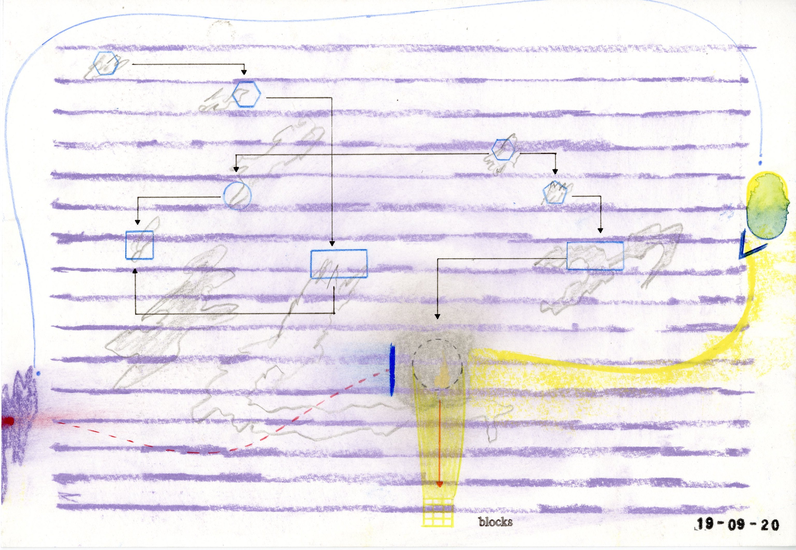
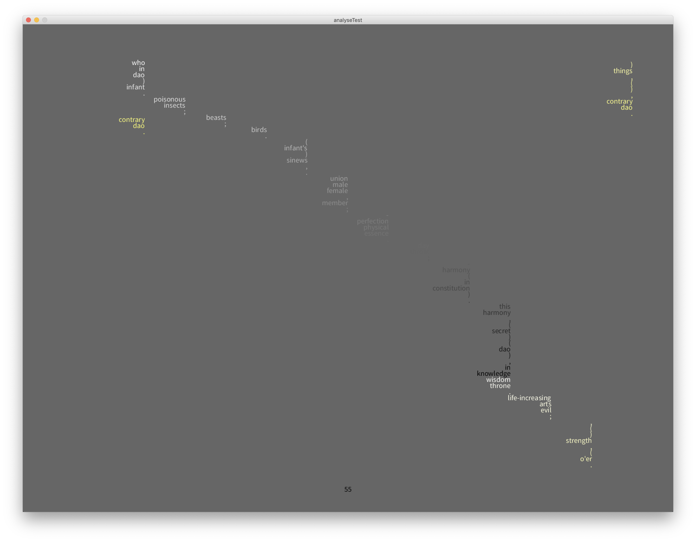

# DAOCPU (work-in-progress)

_DAOCPU_ is a composition that was informed by and developed in parallel to _Ensembl: An Ethereum-Based Platform for Decentralised Organising of Artistic Production_. _Ensembl_ was initiated by Samson Young, Dr. Massimiliano Mollona, and MetaObjects (Andrew Crowe and Ashley Lee Wong) in 2020 (https://www.goethe.de/ins/gb/en/ver.cfm?fuseaction=events.detail&event_id=22087803). 

At present, _DAOCPU_ is consisted of (1) a generative electronic composition written in CHUCK (https://chuck.cs.princeton.edu/); (2) a Dao De Jing analysis and visualization program written in Processing (https://processing.org/), which, is a standalone program but also has a "latent" relationship with the generative composition and may be played together; (3) drawings, which are inspired by the interactions that led to the development of _Ensembl_ (a sort of off-chain record of version history). At present all three components are under development.

Future components of _DAOCPU_ will include: musical instrument design, libretto, and costume. There are two categories of components: "generative" components, and "other" components.

_DAOCPU_ wants to encourage redistribution. The components within _DAOCPU_ may be listened to / viewed on their own. They may also be implemented as basis for recompositions and reperformance. While recomposition is always already possible, _DAOCPU_ tries to encourage it by including more technical documentation. _DAOCPU_ pays tribute to and contributes towards _Ensembl_, but is independent from it. It was inspired by, but also comments on, the evolving dynamics within _Ensembl_.

Technical documentations of the individual component are inside of each of the component's folder.

Below are more general, audience-facing descriptions of the currently-available components.

---

## Component 1: composition, _generative_

This is a generative composition written in CHUCK. It is consisted of four sub-components: a conductor patch that controls time, and three sound-generating "musician" patches.

By downloading the code, and also CHUCK's miniAudicle, a user may listen to / run the standalone version of the composition on the computer. In the standalone version, the musician patches (they are called 'Silvering,' 'Mum Changing Tempo,' and 'Blurred Roland') are making the sound, while the conductor is keeping track of when a patch is about to finish improvizing. When that happens, the conductor introduces the next patch in line, ensuring that there is enough of an overlap between patches so as not to break texture, but not so much that notes clash, or miniAudicle crash. The conductor ocassionally introduces samples of the heart mantra into the texture.

The generative composition may also be paired with the Dao De Jing analysis program. In this combination, the Dao De Jing analysis program functions like a "meta-conductor". It generates "interruption melodies" that causes brief disruptions in musical time. The program achieves this by processing the text of the _Dao De Jing_, and mapping different punctuations to durations. It also takes over the introduction-of-mantra function (from the conductor program).

This component may also be used as a "backing track" for an improvizer to perform alongside. A backing track version of the composition is currently under development.

---

## Component 2: Dao De Jing analysis, _generative_

This is a text analysis and visualization program, written in Processing. The program was designed to perform analysis on a text so that the results may be used to generate other non-text properties (time for music, visual for fabrics, 3d models, etc.).

The program picks a random chapter from James Legge's translation of the _Dao De Jing_ (https://en.wikipedia.org/wiki/Tao_Te_Ching & https://ctext.org/dao-de-jing), and filters the chosen chapter's text using Daniel Howe's riTa library (https://rednoise.org/rita/#reference). At present, the filter leaves only the nouns and the punctuations in the result that it returns. The filtered text becomes the basis for a time strucuture, which is currently implemented as timed disruptions in the generative composition, but may have other uses. 

The program then performs phoneme analysis on the filtered text. Each phoneme is matched with a 3d-shape. These 3d-shapes were created using the "super shape" formula written by Paul Bourke (http://paulbourke.net/geometry/supershape/). This then becomes the basis for visual patterns.

 

 

The program performs additional sentiment analysis on the filtered text, using Google's Natural Language API (https://cloud.google.com/natural-language/). At present, this is provided as a feature, but is not visualized or sonified.

---

## Component 3: Drawings, _other_

These drawings are like visual logs of the evolution of _Ensembl_. They describe (from one perspective) structures, relationship, and interactions. They are not generative in the same way that components 1 & 2 are, as the marks are fixed, but they may be used as prompters for other actions, for example, as graphic scores for music improvization. 

Some graphic scores come with text-based explanations (usually in the form of "key to notation"); in other graphic scores intepretation is left open. The drawings in _DAOCPU_ do not offer key-to-notations, but their intepretation is still informed by its relationship with _Ensembl_, as well as with the other components within _DAOCPU_.

---

## Component 4: Musical instrument, _other_

(Under development)

---

## Component 5: Fabric patterns, _generative_

Custom fabrics (for costumes etc.) via services such as WOVNS (https://www.wovns.com/)...

(Under development)

---

## Component 5: Libretto, _generative_

